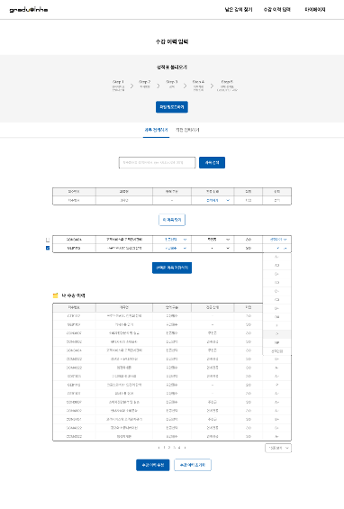
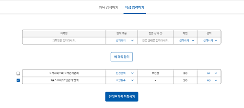
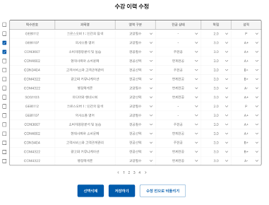
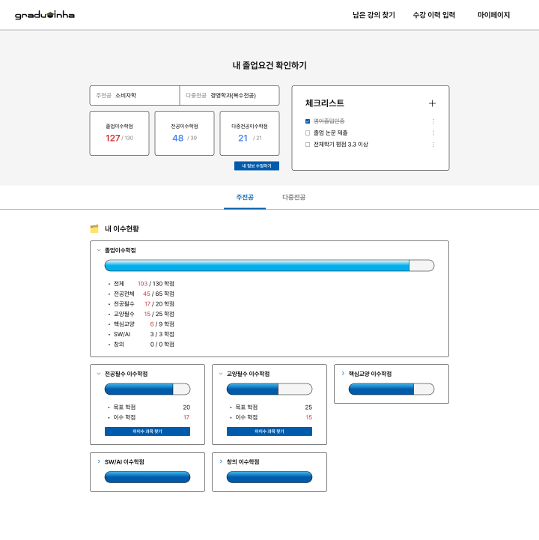
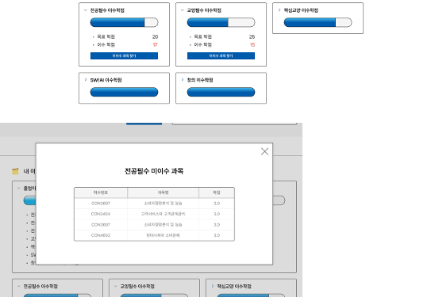
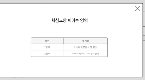

# gradu-inha

인하대학교 학과별, 학번별로 상이한 졸업 요건을 판별해주는 서비스입니다.

사용자의 수강 내역과 학과, 학번을 바탕으로 졸업에 필요한 수업들을 제시합니다.

## 수강 이력 관리

### 수강 내역 입력
학수번호로 검색 -> 사용자에 따른 영역 판별 (수정 가능) -> 성적입력 - > 저장

### 커스텀 수업 입력
ipp, 글로벌 Ict, 편입, 교환학생, 학부연구생(학수번호 추가할 예정), 폐강의 등 학점을 인정받지만 수업내역에 없는 경우를 위해 사용자가 직접 커스텀 하여 수업을 입력할 수 있습니다.

### 수강 내역 수정
사용자가 잘못 입력한 수강 내역에 대해 수정/삭제가 가능합니다.
- 성적 수정 가능
- 영역 수정 가능
- 전공상태 (주전공, 부전공, 단일전공 등) 수정 가능
- 삭제 가능

## 졸업요건 확인하기

이수 학점, 필수 과목 이수 여부를 확인합니다.

졸업 요건 개요
- 전체, 전공, 다중 전공 이수학점 

체크리스트 : 수업 외 졸업요건
- 영어, 졸업 논문 등

상세 이수 내역
- 전공 필수
- 교양 필수
- 핵심 교양
- 창의, SW/AI 

졸업요건 확인하기 상세 확인
미이수 과목/ 영역 출력

필수 과목의 경우 미이수 과목을 보여줍니다.
- 전공 필수
- 교양 필수

핵심교양의 경우 미이수 영역을 보여줍니다.
- 추후 영역별 과목 리스트 출력 기능 추가
- 지정과목/대체과목 출력 기능 추가

( _창의, SW/AI의 경우, 지정과목/대체과목 출력_ )
